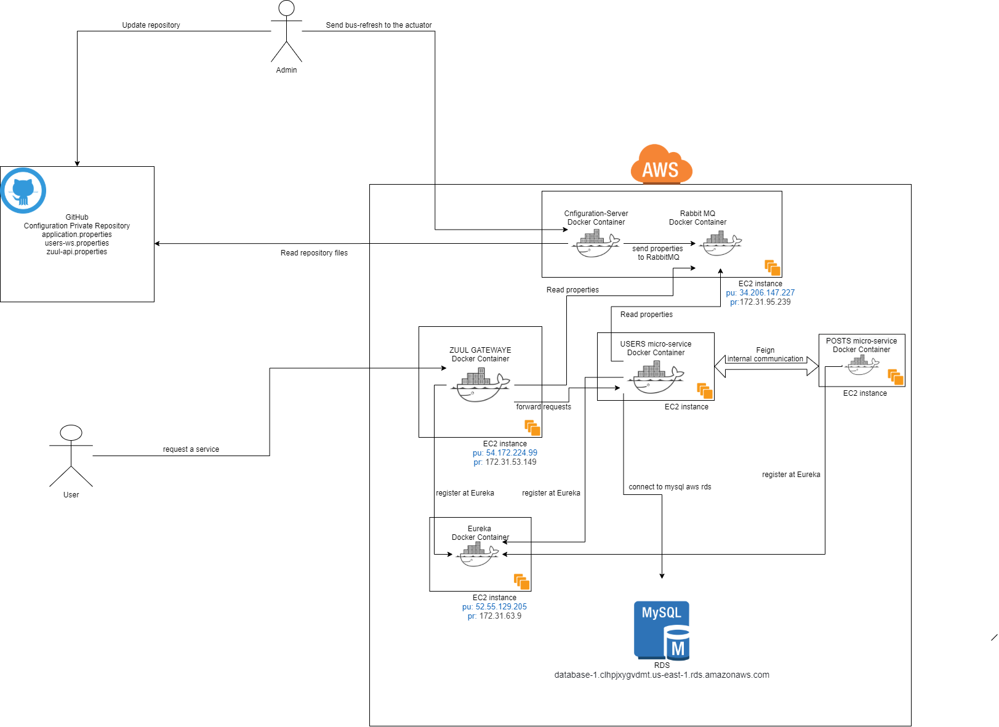
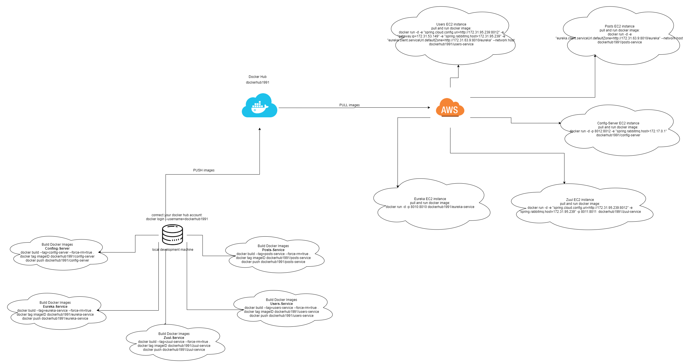

# aws-docker-deployment

To run the application just follow the pictures. It contains all information and change the rds parameters in the users-ws.properties file and also change the github credentials in the config-server's apllication.properties file to your account credentials.
<h2>system-architecture</h2>

<h2>deployment-process</h2>

